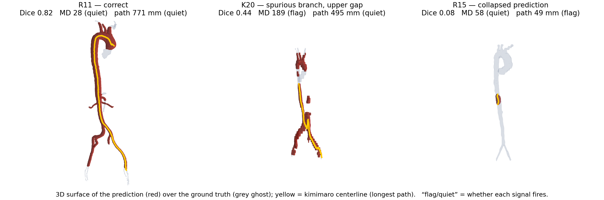

# aorta-seg-reliability-audit

Code for **"Complementary Reliability Axes for Aortic CTA Segmentation: An Empirical
Audit"** (UNSURE workshop, MICCAI 2026).

The paper is an empirical audit, not a new method. It asks whether three post-hoc
reliability signals that operate on different objects detect the same segmentation
failures or expose distinct ones, across 962 cases from four datasets. A 23-class
nnU-Net is trained on AortaSeg24 and evaluated on AVT, AMOS and TotalSegmentator.



Three AVT cases: prediction surface (red) over the ground-truth ghost (grey), with
the kimimaro longest-path centerline in yellow. R11 is correct and both signals stay
quiet. K20 has a spurious duplicated abdominal branch plus a gap higher in the
descending aorta; its path stays full-length at 495 mm so the centerline rule is
quiet, but the odd shape raises the Mahalanobis distance. R15 collapses to a
fragment inside an intact aorta, so its path falls to 49 mm and flags, while the
Mahalanobis distance stays near the AVT median and is quiet. Each failure is caught
by a different signal, and that disagreement is the point of the audit.

## What the paper finds

Three signals form three non-redundant axes:

| Signal | What it measures | Where it works |
|---|---|---|
| Mahalanobis encoder-feature distance | displacement of the input from the training distribution | separates in- from out-of-distribution, does **not** rank case Dice within an OOD cohort |
| Mean pairwise Dice over `T=20` MC-Dropout argmaxes | proximity to the decision boundary | ranks case Dice both in and out of distribution, near-orthogonal to feature distance |
| Centerline degeneracy (longest geodesic path) | whether the predicted vessel tree is broken | catastrophic-failure detector, silent in distribution where nothing is broken |

MSP and kNN serve as baselines. No union, intersection, or standardized score-level
combiner beats the strongest single signal. Their value is complementary failure
coverage: individual catastrophic cases are caught by one signal and missed by
another.

## Layout

```
src/       preprocessing, training, reliability signals, measurements, analysis
configs/   dataset case lists and the official AortaSeg24 split
results/   per-case scores and summary statistics behind the reported numbers
```

Rough order of use: `prepare_*.py` → `train_baseline.py` / `train_mc_dropout.py` →
`inference_*.py` and `baseline_*.py` → `measurements.py` → `analyze_*.py` →
`bootstrap_metrics.py`. The three `plot_*.py` scripts regenerate the paper figures.

## Data

No imaging data or model checkpoints here. The datasets are public:

| Dataset | Source | License |
|---|---|---|
| AortaSeg24 | [aortaseg24.grand-challenge.org](https://aortaseg24.grand-challenge.org) | data use agreement required |
| AVT | figshare `10.6084/m9.figshare.14806362` | CC BY-NC-SA 4.0 + source EULA |
| AMOS | Zenodo `10.5281/zenodo.7262581` | CC BY 4.0 |
| TotalSegmentator v2.0.1 | Zenodo `10.5281/zenodo.10047292` | CC BY 4.0 |

## Setup

Python 3.10, conda-forge where possible. Install `vmtk` first so it anchors its
VTK/ITK tree, and don't `pip install vmtk` (the PyPI package is abandoned).

```bash
mamba install -c conda-forge vmtk nibabel simpleitk scikit-image pandas \
    matplotlib scikit-learn tqdm
mamba install -c pytorch -c nvidia pytorch torchvision pytorch-cuda=12.1
pip install nnunetv2 kimimaro crackle-codec
```

nnU-Net paths go in a `.env` at the repo root. `nnunet_run.py` injects them into
nnU-Net CLI calls:

```bash
python nnunet_run.py nnUNetv2_train 001 3d_fullres 0
```

Trained on a single RTX A5000 (24 GB).

## Citation

```bibtex
@inproceedings{olive2026complementary,
  author    = {Olive, Thomas},
  title     = {Complementary Reliability Axes for Aortic {CTA} Segmentation:
               An Empirical Audit},
  booktitle = {Uncertainty for Safe Utilization of Machine Learning in Medical
               Imaging (UNSURE), MICCAI Workshop},
  year      = {2026}
}
```

Code is MIT licensed. The datasets keep their own licenses, listed above.
`docs/qualitative_avt_3d.png` renders AVT data, so that image follows the AVT
dataset's CC BY-NC-SA 4.0 terms rather than the MIT license, and is attributed to
Radl et al., *Data in Brief* 40 (2022).
